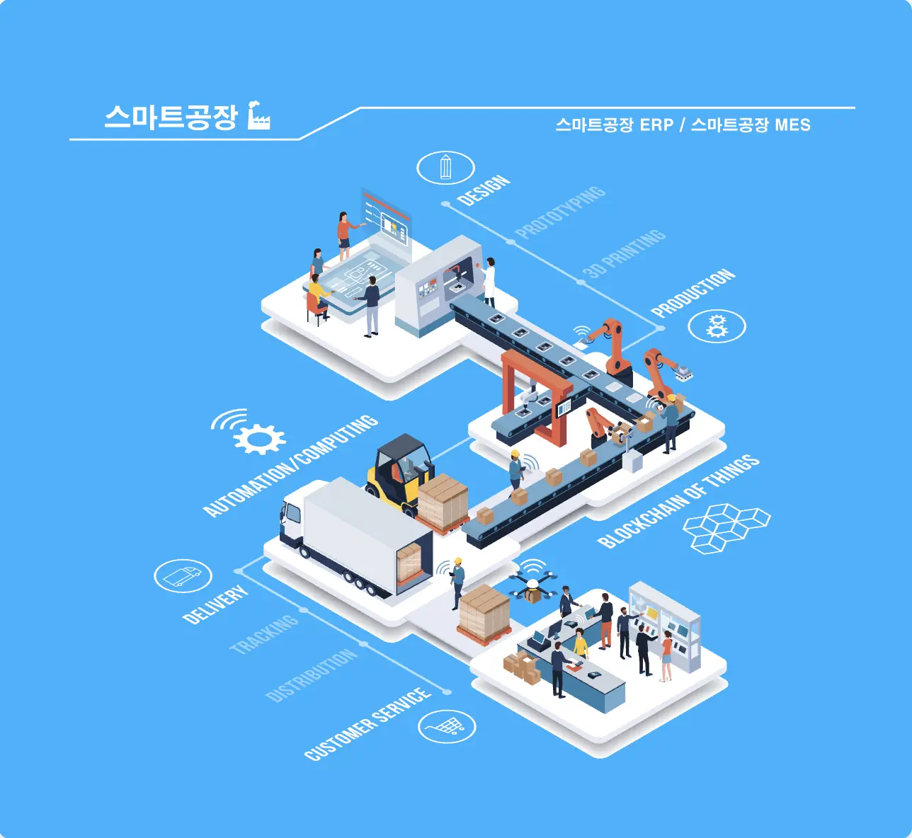
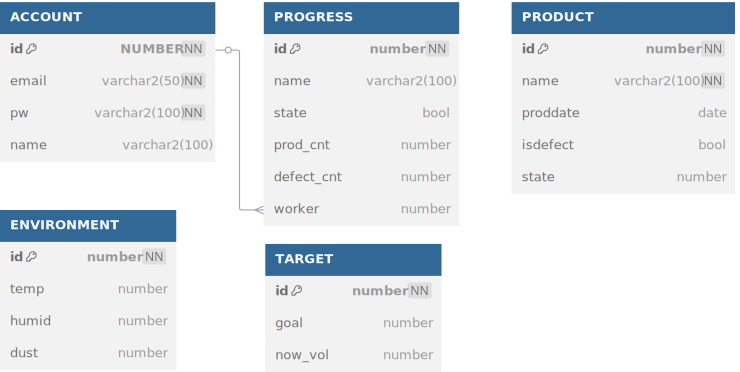
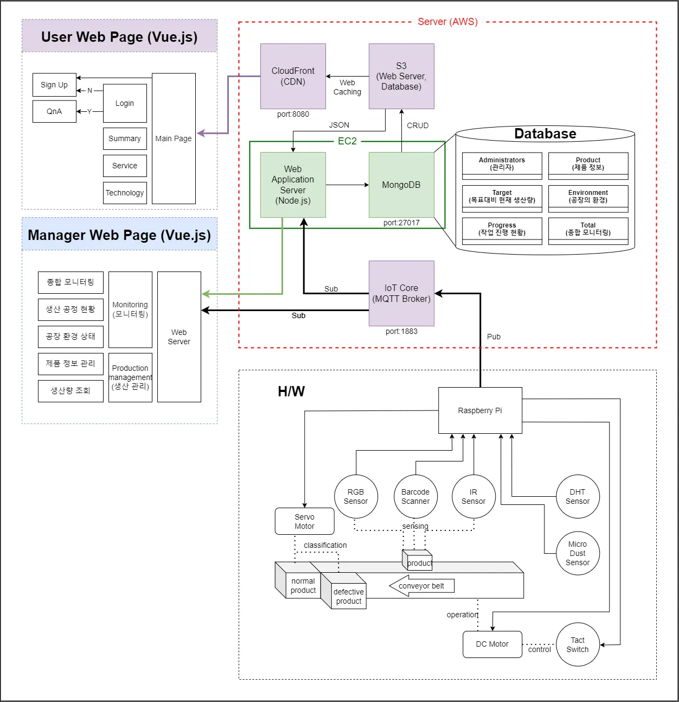
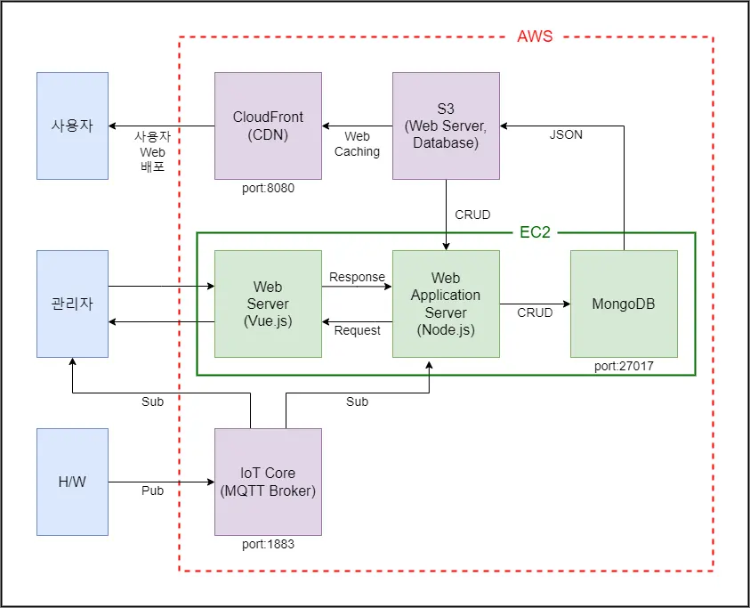
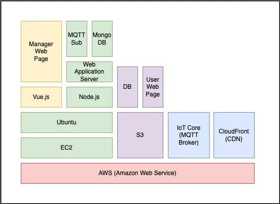
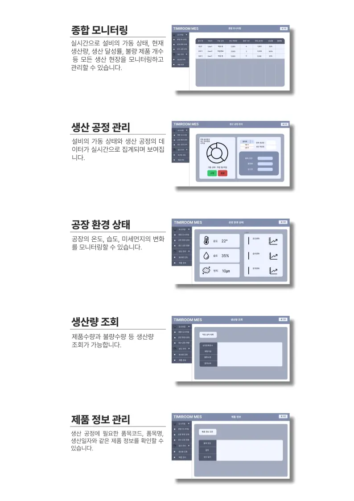
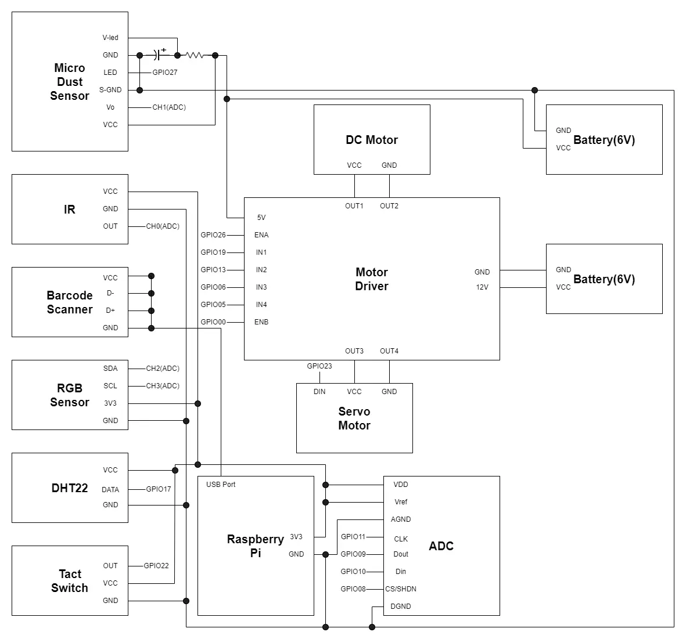
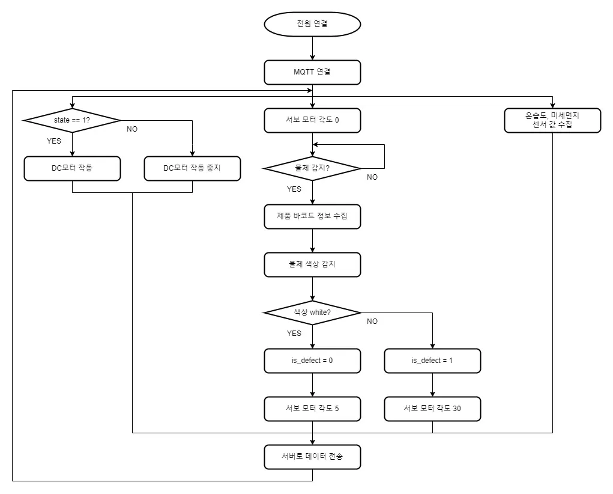
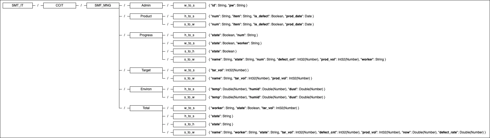

#### 2022년 1학기 CCIT 융합전공 프로젝트

    

### 🎯&nbsp;Subject

> SmartFactory Management System (Web/ERP)

### 🗓️&nbsp;Date

> 2022.03 ~ 2022.08

### 🚀&nbsp;Intro & Function

>  기존 생산 분야의 구형 시스템과 아날로그 설비들을 IoT, 빅데이터와의 융합을 통해 스마트팩토리로 거듭날 수 있는 기반을 다지는 것을 목표로 두고 있습니다.
>
> #### 담당 주요 기능
> 
> - 프로젝트 매니저(PM) 담당
> - Backend API 설계 및 구현
> - AWS EC2(Backend), CloudFront(Front/CDN) 배포
> - MQTT 연동 (Arduino - RaspberryPi - AWS IoT Core - AWS EC2)

### 📚&nbsp;Tech Stack

### 📄&nbsp;Document

> [전체 발표자료.pdf](public/doc/presentationMain.pdf)  
> [시스템규격서.pdf](public/doc/systemStandard.pdf)  

> [서버 발표자료.pdf](public/doc/presentationServer.pdf)  
> [서버 최종보고서.pdf](public/doc/reportServer.pdf)  
> [웹 페이지 디자인.pdf](public/doc/frontDesign.pdf)  

> [특허 분석.pdf](public/doc/특허%20분석.pdf)  
> [선도 기업 분석.pdf](public/doc/선도%20기업%20분석.pdf)  
> [정부 지원 및 규제.pdf](public/doc/정부%20지원%20및%20규제.pdf)  

### 📂&nbsp;ERD

    

### ⚙️&nbsp;Architecture

---

    
전체 구조

    

    
데이터 흐름도

    

    
AWS & 서버 설계도

    

    
웹 기능도

    

    
하드웨어 회로도

    

    
하드웨어 플로우 차트

    

    
MQTT Topic API

    

